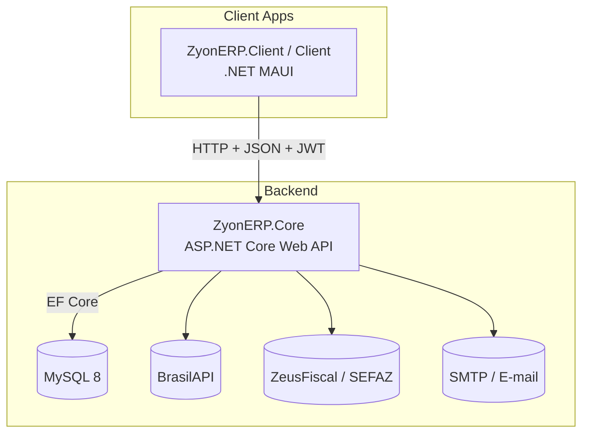
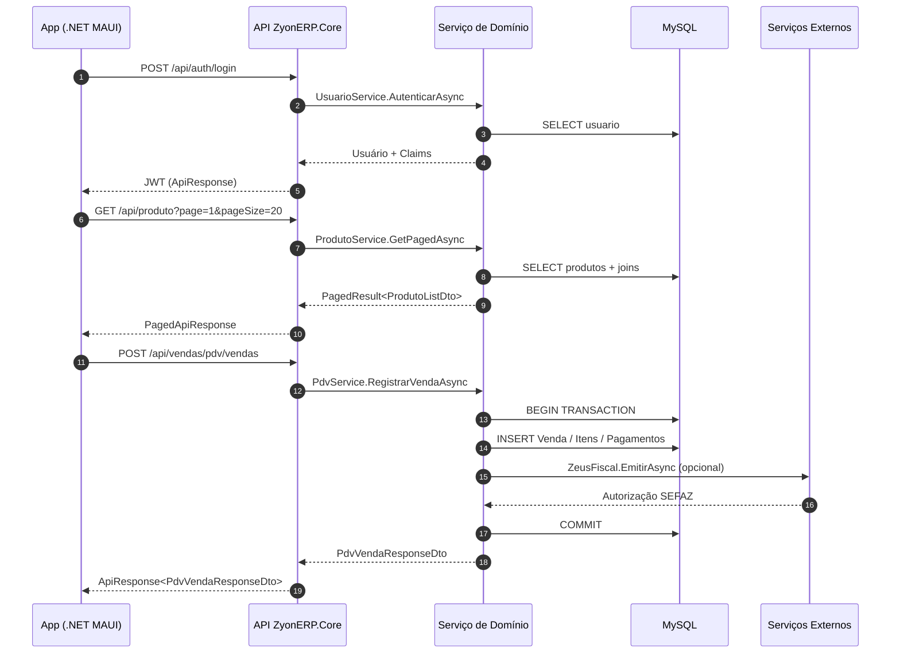
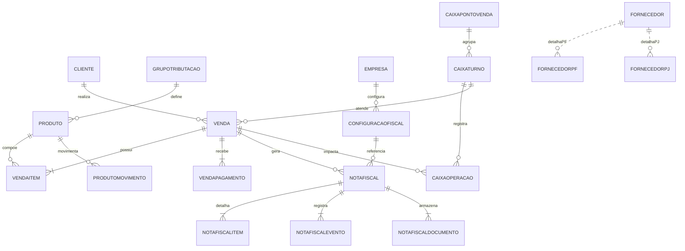

# Arquitetura do ZyonERP

## Índice
1. [Visão geral](#visão-geral)
2. [Backend (ZyonERP.Core)](#backend-zyonerpcore)
   - [Estrutura de pastas](#estrutura-de-pastas)
   - [Pipeline de requisições](#pipeline-de-requisições)
   - [Serviços e regras de negócio](#serviços-e-regras-de-negócio)
   - [Integrações externas](#integrações-externas)
   - [Configurações e middlewares](#configurações-e-middlewares)
   - [Banco de dados e migrations](#banco-de-dados-e-migrations)
   - [Autenticação e autorização](#autenticação-e-autorização)
3. [Camada compartilhada (ZyonERP.Shared)](#camada-compartilhada-zyonerpshared)
4. [Clientes .NET MAUI](#clientes-net-maui)
   - [Estrutura](#estrutura)
   - [Serviços de infraestrutura](#serviços-de-infraestrutura)
   - [Navegação e MVVM](#navegação-e-mvvm)
5. [Fluxos de dados entre camadas](#fluxos-de-dados-entre-camadas)
6. [Diagrama de entidades (ERD)](#diagrama-de-entidades-erd)
7. [Fluxo de navegação do usuário](#fluxo-de-navegação-do-usuário)

---

## Visão geral

O ZyonERP adota uma arquitetura em camadas que separa claramente domínio, aplicação e apresentação. O núcleo de regras de negócio reside no projeto `ZyonERP.Core`, que expõe uma API RESTful consumida pelos aplicativos .NET MAUI (`ZyonERP.Client` e `Client`). O projeto `ZyonERP.Shared` contém o modelo canônico (entidades auditáveis, DTOs, enums e contratos) compartilhado entre backend e frontend.



Principais características:

- **Uniformização**: controllers herdam de `BaseCrudController` ou implementam endpoints específicos seguindo o padrão `ApiResponse`/`PagedApiResponse`.
- **Reuso**: serviços genéricos (`BaseCrudService`, `BaseCancelableService`) encapsulam CRUD, paginação, auditoria e hooks.
- **Validação consistente**: todas as rotas que escrevem dados são protegidas por `FluentValidation` e regras de negócio explícitas.
- **Automação**: migrations são aplicadas automaticamente na inicialização e seeders garantem dados mínimos (usuário admin, catálogo "Diversos", formas de pagamento padrão, empresa modelo).
- **Integrações**: camada fiscal acopla serviços de emissão (ZeusFiscal), envio de e-mails e consulta de dados públicos (BrasilAPI) com caching.

---

## Backend (ZyonERP.Core)

### Estrutura de pastas

| Pasta | Conteúdo |
| --- | --- |
| `Configuration/` | Tipos de opções (`JwtSettings`, `ZeusFiscalOptions`, `SmtpSettings`). |
| `Controllers/` | Controllers organizados por domínio (`Entidades`, `Fiscal`, `Vendas`, `Estoque`, `Integracoes`). |
| `Controllers/Base/` | `BaseCrudController` e `BaseCancelableController` definindo endpoints e responses padrão. |
| `Data/` | `AppDbContext`, configuração fluente das entidades e seeders. |
| `Helpers/` | Utilitários de logs, formatação e helpers de middleware. |
| `Mappers/` e `Mappings/` | Perfis AutoMapper por domínio (produtos, usuários, caixas, fiscal). |
| `Middleware/` | Middlewares transversais (ex.: tratamento de exceções, logs). |
| `Seeders/` | Extensões de `AppDbContext` para plantar dados iniciais. |
| `Services/` | Implementações genéricas e específicas para cada domínio (Produtos, Clientes, Fiscal, Vendas, Segurança, Integrações). |
| `Validators/` | Validadores FluentValidation agrupados por domínio. |
| `Program.cs` | Configuração de DI, autenticação, CORS, swagger, migrations e seed. |

### Pipeline de requisições

1. **Configuração de portas**: Kestrel escuta HTTP na porta 5000.
2. **Migrations + Seed**: na inicialização (`Program.cs`) as migrations são aplicadas e seeders executados.
3. **Middleware**: em desenvolvimento o Swagger é ativado. Em qualquer ambiente, CORS permite origem/método/cabeçalhos livres (ajuste em produção). Autenticação JWT e autorização são aplicadas antes de `MapControllers`.
4. **Controllers**: expõem endpoints REST com respostas padronizadas. A maior parte herda das classes base que já implementam `GET`, `GET paginado`, `GET id`, `POST`, `PUT`, `DELETE`, `PATCH` (ativar/desativar) e `Exists`.
5. **Serviços**: cada controller injeta um serviço (`ProdutoService`, `ClienteService`, `CaixaService`, etc.) responsável por encapsular lógica de negócio, transações, validações e integração com EF Core.
6. **EF Core**: `AppDbContext` usa Pomelo MySQL com mapeamento fluente (índices, relacionamentos, tipos decimal, owned types). Hooks de auditoria preenchem `DataCriacao`, `DataAlteracao`, `UsuarioCriacao` etc.

### Serviços e regras de negócio

- **Produtos (`ProdutoService`)**
  - Normaliza strings, aplica defaults fiscais via `GrupoTributacao`, gera movimentos de estoque automáticos (`ProdutoMovimento`) e valida preços/estoque.
  - Métodos especializados: `GetProdutosEstoqueBaixoAsync`, busca por código de barras ou referência, movimentação em lote (`ProcessarMovimentacaoEstoqueBatchAsync`) e ativação/desativação.

- **Clientes (`ClienteService`)**
  - Pesquisa inteligente (`SearchAsync`), valida CPF/CNPJ, garante imutabilidade de documento após criação, sincroniza dados de endereço e contatos.

- **Empresas (`EmpresaService`)**
  - Soft delete, ativação/desativação, busca por CNPJ.

- **Grupos de Tributação (`GrupoTributarioService`)**
  - Filtros ricos (status, regime, origem), toggling de status com auditoria.

- **Vendas / PDV (`VendaService`, `PdvService`, `CaixaService`)**
  - Gerenciam todo o ciclo de vendas: inclusão/alteração/remoção de itens, descontos, finalização, cancelamento, geração de pagamentos.
  - Caixa: abertura, reabertura, fechamento, sangrias, suprimentos, operações ligadas a vendas.
  - PDV: produtos, clientes, registro de vendas, resumo pós-venda.

- **Fiscal (`FiscalService`, `ConfiguracaoFiscalService`)**
  - Consulta e persistência de configurações fiscais (séries, CSC, certificado digital, ambiente).
  - Emissão de notas avulsas, reprocessamento, download/envio de documentos, incremento de números de NFe/NFCe.
  - Integração com ZeusFiscal para comunicação SEFAZ.

- **Segurança (`UsuarioService`, `JwtTokenService`)**
  - Autenticação, hash de senhas, tokens JWT com tempo configurável, controle de status dos usuários.

### Integrações externas

- **BrasilAPI**: HttpClient com timeout de 10s para buscas de CEP/CNPJ. Resultados retornam DTOs específicos (`CepDto`, `CnpjDto`).
- **ZeusFiscal**: `IFiscalIntegrationService` encapsula chamadas ao provedor fiscal (envio XML, consulta, cancelamento). Configurado via `ZeusFiscalOptions`.
- **E-mail**: `FiscalEmailService` usa `ISmtpClientFactory` (MailKit) para envio de DANFE/recibos.

### Configurações e middlewares

- `Program.cs` registra AutoMapper, FluentValidation, serviços de domínio, HttpClient, CORS e Swagger.
- Configurações carregadas via `appsettings.json`/`appsettings.Development.json` ou variáveis de ambiente (seguindo convenções `Section__Property`).
- CORS padrão `AllowAnyOrigin/Method/Header` (restringir em produção).
- Swagger inclui esquema Bearer para JWT.

### Banco de dados e migrations

- `AppDbContext` mapeia todas as entidades do domínio (`Produto`, `Cliente`, `Fornecedor`, `Venda`, `Caixa`, `NotaFiscal`, etc.).
- Campos monetários usam `decimal(12,2)` / `decimal(14,2)`; quantidades `decimal(14,3)`.
- Owned types (`EnderecoFornecedor`, `DadosBancariosFornecedor`) são mapeados com prefixo.
- Seeds garantem dados base: usuário administrador, catálogo "Diversos", formas de pagamento, empresa modelo.
- Migrations residem em `Migrations/` e são aplicadas automaticamente no startup.
### Autenticação e autorização

- JWT Bearer com configurações em `JwtSettings` (`Secret`, `Issuer`, `Audience`, `ExpiresInMinutes`).
- `AuthController` expõe `POST /api/auth/login` e `GET /api/auth/health`.
- Endpoints utilizam `[Authorize]` por padrão; rotas públicas (login, BrasilAPI) utilizam `[AllowAnonymous]`.
- Token validation sem clock skew (`ClockSkew = TimeSpan.Zero`), evita logins duplicados.

---

## Camada compartilhada (ZyonERP.Shared)

Elementos principais:

- **Entidades base**
  - `EntidadeBase`: ID, `StatusCadastro`, `DataCriacao`, `DataAlteracao`, `DataDesativacao`, auditoria de usuário e observações.
  - `PessoaBase`, `PessoaFisicaBase`, `PessoaJuridicaBase`: campos comuns reutilizados por Cliente/Fornecedor.

- **Domínio**
  - `Models/Entidades` cobre produtos, catálogos, clientes, fornecedores, empresas, grupos de tributação.
  - `Models/Vendas` define `Venda`, `VendaItem`, `VendaPagamento`, `CaixaPontoVenda`, `CaixaTurno`, `CaixaOperacao`, `CaixaSaldoDia`.
  - `Models/Fiscal` inclui `NotaFiscal`, `NotaFiscalItem`, `NotaFiscalEvento`, `ConfiguracaoFiscal` e estruturas auxiliares.

- **DTOs**
  - Organizamos por domínio (`DTOs/Entidades`, `DTOs/Tributacao`, `DTOs/Fiscal`, `DTOs/Vendas`, `DTOs/Estoque`).
  - Base classes (`BaseCreateDto`, `BaseUpdateDto`, `AuditableActivatableListDto`, etc.) facilitam padronização.

- **Enums**
  - Representam status (cadastro, vendas, pagamento), tipos fiscais (documento, ambiente, modo emissão), pessoa, origem de produto, formas de pagamento.

- **Interfaces**
  - Contratos para serviços específicos (`IVendaService`, `IPdvService`, `IFiscalService`, `IBrasilApiService`) e base (`ICrudService`).

- **Respostas padrão**
  - `ApiResponse<T>` / `PagedApiResponse<T>` / `ApiResponseItem` normalizam saída da API.

Essa camada garante que front e back compartilhem o mesmo contrato, minimizando mapeamentos manuais.

---

## Clientes .NET MAUI

### Estrutura

| Pasta | Conteúdo |
| --- | --- |
| `App.xaml` / `AppShell.xaml` | Tema, recursos e rotas globais. |
| `MauiProgram.cs` | Registro de serviços (DI), singletons (ApiService, NavigationService, token storage). |
| `Views/` | Páginas XAML agrupadas por domínio (`Cadastros`, `Vendas`, `Fiscal`, `Estoque`, `Configuracoes`, `Popups`). |
| `ViewModels/` | ViewModels com `CommunityToolkit.MVVM`. `BaseViewModel` implementa `INotifyPropertyChanged`, `IsBusy`, `Title`, `DisplayAlerts`. |
| `Services/` | `ApiService`, `NavigationService`, `ApiConfigurationService`, `TokenStorageService`, `ConnectivityService`. |
| `DTOs/` | Modelos específicos da camada de apresentação (ex.: `FornecedorFullDto`). |
| `Resources/` | Fonts, estilos, imagens (logos, ícones Material). |

### Serviços de infraestrutura

- **ApiService**: wrapper sobre `HttpClient`, injeta cabeçalho Bearer automaticamente, trata indisponibilidade com evento `AvailabilityChanged`, oferece métodos tipados para cada endpoint.
- **ApiConfigurationService**: leitura e persistência do `conexao.json`, troca de endpoint/timeout em tempo de execução.
- **TokenStorageService**: salva tokens JWT em `SecureStorage` (mobile) ou `Preferences` (desktop).
- **NavigationService**: controla rotas do AppShell, abre popups, modais e navegação hierárquica.
- **ConnectivityMonitorService** (quando habilitado): observa conectividade e reflete no UI.

### Navegação e MVVM

- `MainPage.xaml` define uma sidebar responsiva com grupos (Dashboard, Vendas, Cadastros, Fiscal, Estoque, Configurações). Em dispositivos móveis a sidebar se transforma em menu hamburguer.
- `NavigationService` registra rotas para páginas como `ProdutosPage`, `ClientesPage`, `PdvPage`, `CaixaPage`.
- Popups (`CommunityToolkit.Maui.Views.Popup`) são usados para formulários modais (cadastro/edição de produtos, filtros, confirmações).
- ViewModels usam `RelayCommand`/`AsyncRelayCommand`, `ObservableCollection`, `SetProperty`. Filtros são aplicados localmente sem bloquear a UI, com debounce (produtos) e infinite scroll.
- ViewModels de PDV e Caixa compartilham contextos (`PdvPagamentoContext`) para compor telas com múltiplos passos (itens, pagamentos, fechamento).

---

## Fluxos de dados entre camadas



---

## Diagrama de entidades (ERD)



> **Observação:** relacionamentos adicionais (ex.: `VendaFormaPagamento`, `CaixaSaldoDia`) seguem a mesma convenção e podem ser consultados diretamente em `ZyonERP.Shared/Models`.

---

## Fluxo de navegação do usuário

```mermaid
graph LR
    Login[Login] --> Dashboard
    Dashboard -->|Card Cadastros| Cadastros
    Dashboard -->|Card PDV| PDV
    Dashboard -->|Card Fiscal| Fiscal
    Dashboard -->|Card Estoque| Estoque

    subgraph Cadastros
        Produtos --> ProdutoDetalhes
        Produtos --> ProdutoForm
        Clientes --> ClienteForm
        Fornecedores --> FornecedorForm
        Catalogos --> {Categorias,Grupos,Subgrupos,Marcas}
    end

    subgraph PDV
        PDV --> CaixaAbertura
        CaixaAbertura --> CaixaTurno
        CaixaTurno --> PDVVenda
        PDVVenda --> Pagamento
        Pagamento --> Impressao
        CaixaTurno --> CaixaFechamento
    end

    subgraph Fiscal
        Fiscal --> ConfigFiscal
        Fiscal --> NotasFiscais
        NotasFiscais --> NotaDetalhes
        NotasFiscais --> EnvioEmail
    end

    subgraph Estoque
        Estoque --> MovimentacaoBatch
        Estoque --> ProdutoEstoque
    end

    Configuracoes --> ApiConfig
```

- **Login**: autentica via JWT. Ao sucesso, `MainPage` exibe dashboard e contador de módulos.
- **Menu lateral**: navegação agrupada (Dashboard, Vendas/PDV, Cadastros, Fiscal, Estoque, Configurações). Em dispositivos móveis utiliza menu accordion.
- **Popups**: formulários (novo produto, filtros, confirmação de exclusão) usam popups para evitar navegação profunda.
- **Configurações**: permite alterar URL da API, timeout e limpar credenciais.